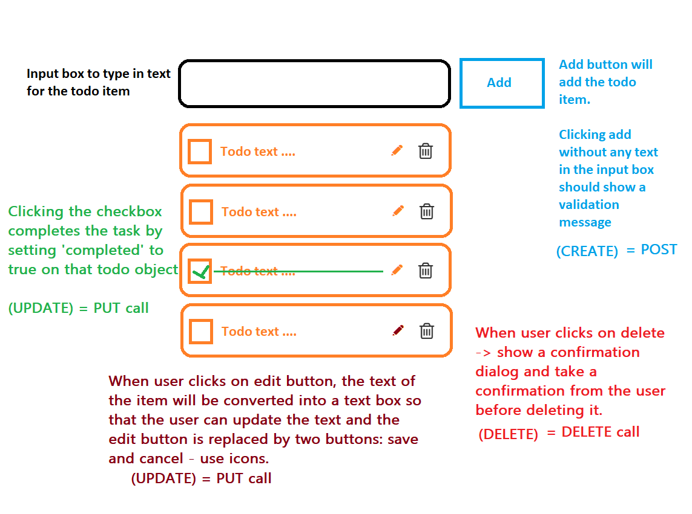

# TODOs

## First Run

```bash
# clone the repository and run the following command in the root directory
npm install
```

## Run server

Run the following command in a new terminal to start the server:

```bash
npm run server
```

## Run client

Run the following command in a new terminal to start the client:

```bash
npm run dev
```

## API

Server usually runs on port 3000.

### GET http://localhost:3000/todos

Get all todos.

### POST http://localhost:3000/todos

Create a new todo.

#### Body:

```json
{
  "task": "Example todo 2",
  "completed": false,
  "createdOn": "2025-02-20T11:17:26.703Z"
}
```

### PUT http://localhost:3000/todos/:id

Update a todo with a specific `id`. Replace the `:id` with the actual id of the todo.

> Have to pass the whole object.

#### Body:

```json
{
  "task": "Example todo 2",
  "completed": true,
  "createdOn": "2025-02-20T11:17:26.703Z"
}
```

### DELETE http://localhost:3000/todos/:id

Delete a todo with a specific `id`. Replace the `:id` with the actual id of the todo.

## Mockup



> Every CRUD operation should update the server with the new data via the API calls.

## Requirements

- [ ] Create a new todo
- [ ] Update a todo
- [ ] Delete a todo
- [ ] Mark a todo as completed
- [ ] Show all todos
